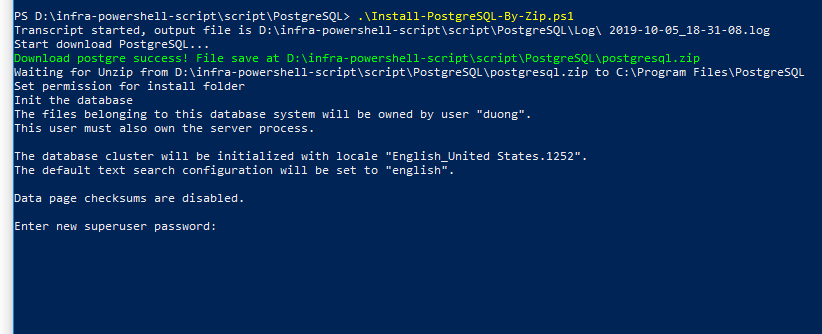

# Guilde for use script

1. Run your powershell as administrator
2. Enable permission for current powershell session to execute command ```Set-ExecutionPolicy -Scope Process -ExecutionPolicy Bypass```
3. Move to folder store script and run script ```Install-PostgreSQL.ps1``` or ```Install-PostgreSQL-By-Zip.ps1```

## Note

- I'm try to write script to install by zip archive without the installer(```Install-PostgreSQL-By-Zip.ps1```) it seems like it is faster than installing with an .exe file and this script base on steps on this [video](https://www.youtube.com/watch?v=LrxVQFQRIcE) that I find on the internet.

- If you run ```Install-PostgreSQL-By-Zip.ps1``` you must enter password like this
 and I don't find any solution to do this automation

- You should try ```Install-PostgreSQL.ps1``` for install PostgreSQL it base on your documents (Setup PostgreSQL and Firewall setting) but it can take more time than install by zip archive.
