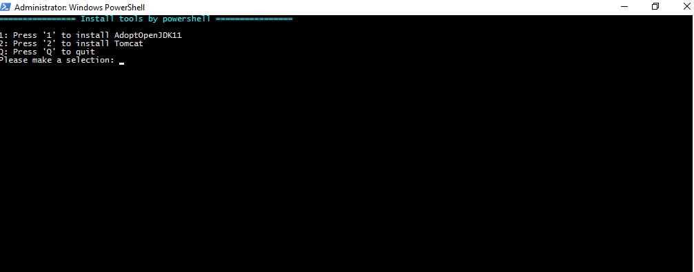
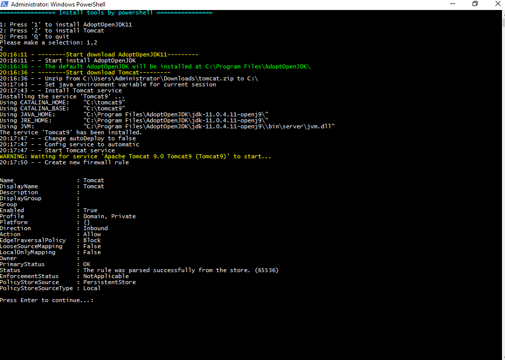
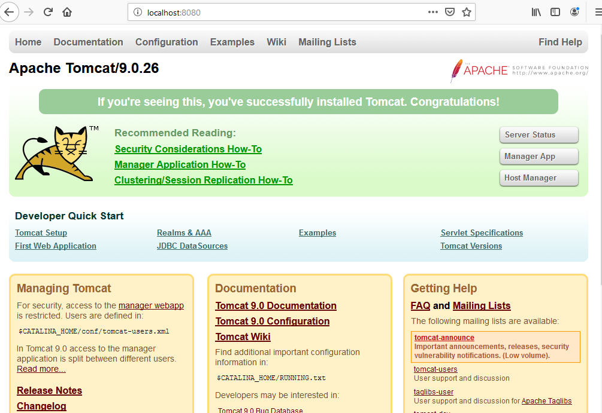
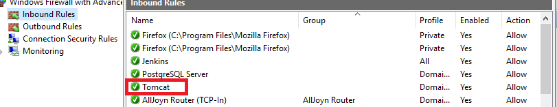
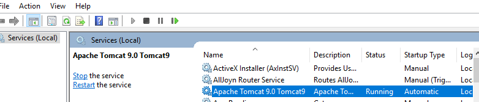
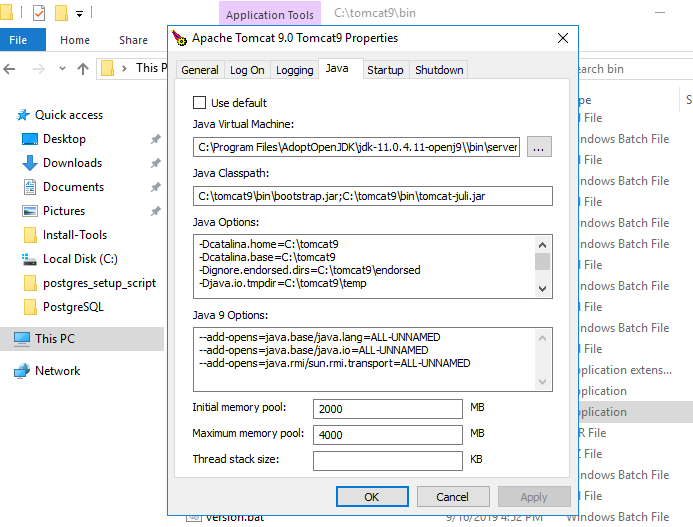
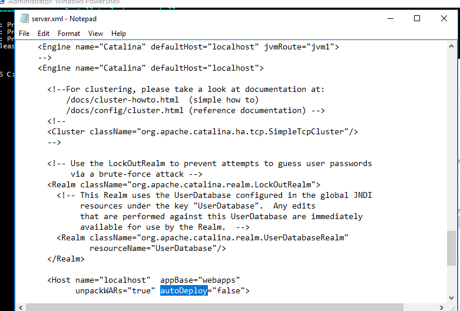

# Install tomcat

- Run your powershell as administrator
- Enable permission for current powershell session to execute command `Set-ExecutionPolicy -Scope Process -ExecutionPolicy Bypass`
- Move to folder store script and run *Install-Tomcat.ps1* script you will see a menu like below

- If you already installed AdoptOpenJDK11 just choose to install Tomcat
- I will choose 1,2 to install AdoptOpenJDK then install Tomcat

- You can see result below:

- Firewall

- Service

