# Install Jenkins and tools by Powershell

## Table of content

  1. [Guideline for using this script](#guide)
  2. [Config Jenkins](#config)
  3. [Install plugin](#plugin)
  4. [Create an agent (node in Jenkins)](#node)
  
---

### Guideline for using this script

- **Step 1**: Run your powershell as administrator
- **Step 2**: Enable permission for current powershell session to execute command `Set-ExecutionPolicy -Scope Process -ExecutionPolicy Bypass`
- **Step 3**: Move to folder store script and run *Install-Tools.ps1* script you will see a menu like below
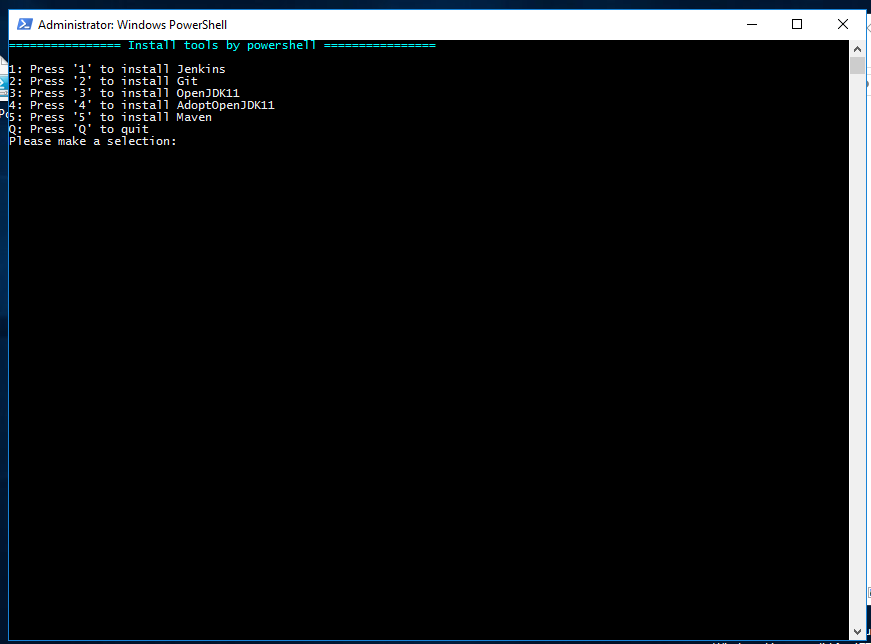
- **Step 4**: Choose one or multiple option. Example:
  - I want to install tools on agent so I choose 2,4,5 to install Git, AdoptOpenJDK11, Maven.
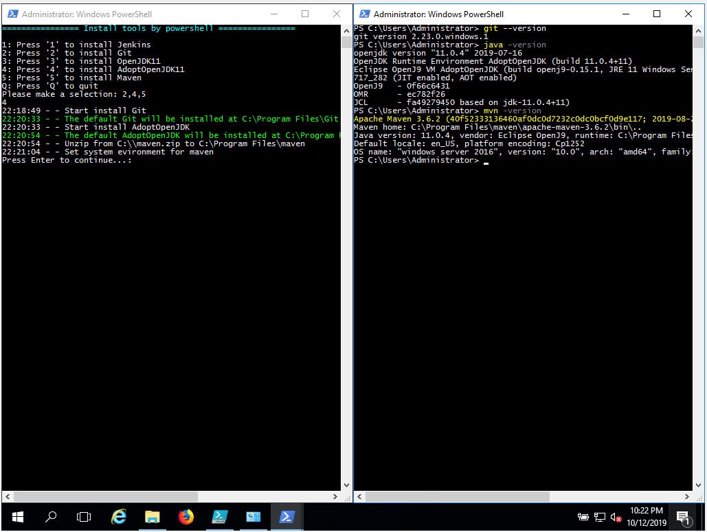
  - If you want to install Jenkins just choose option 1 to install.
  - 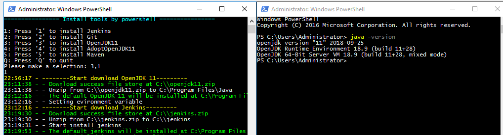

### Config Jenkins

- After install jenkins success you can access to [localhost:8080](http://localhost:8080) you will see as image below
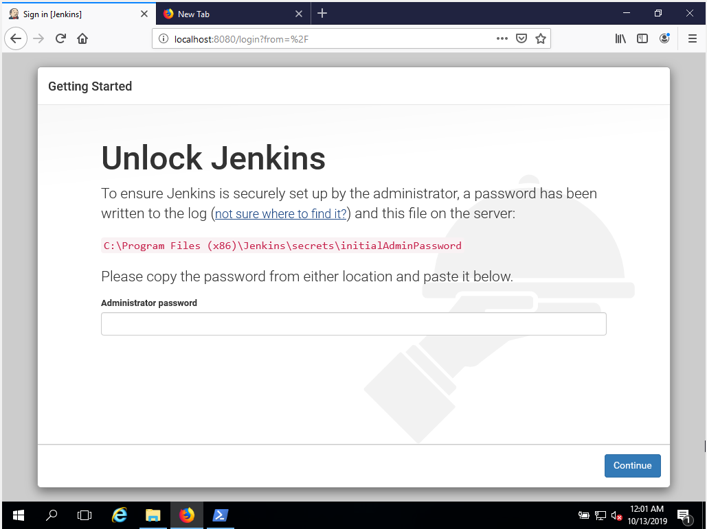
- As you can see, you must copy password from *C:\Program Files (x86)\Jenkins\secrets\initialAdminPassword* and paste to *Administrator password* field >> Continue
- After that choose *Install suggested plugins*
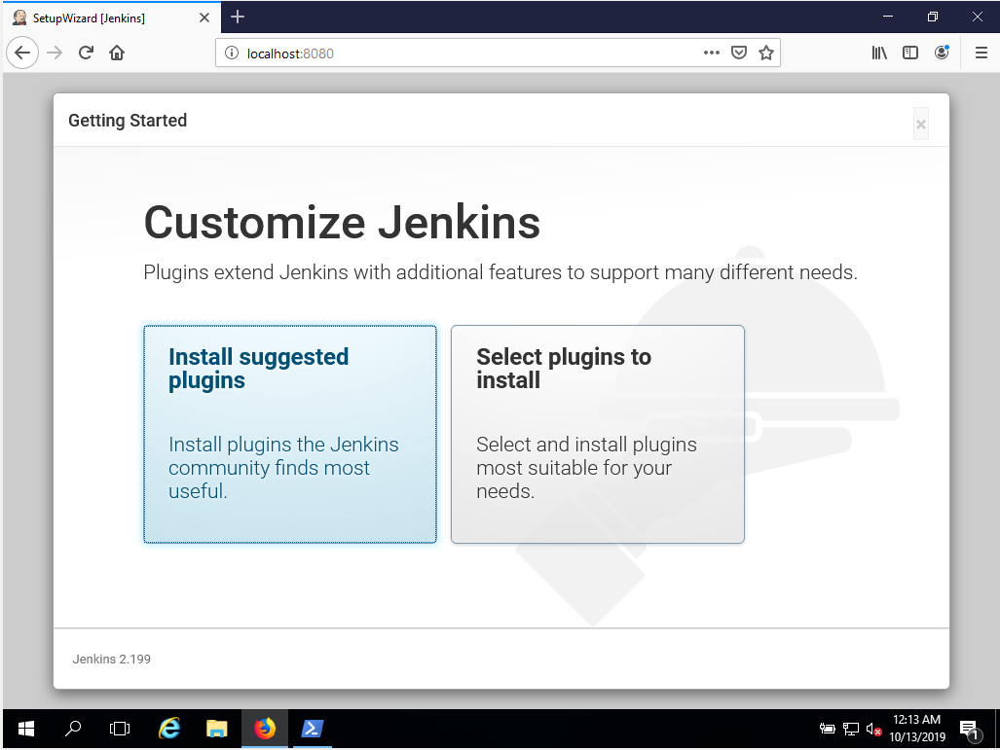
- Wait for plugin install success
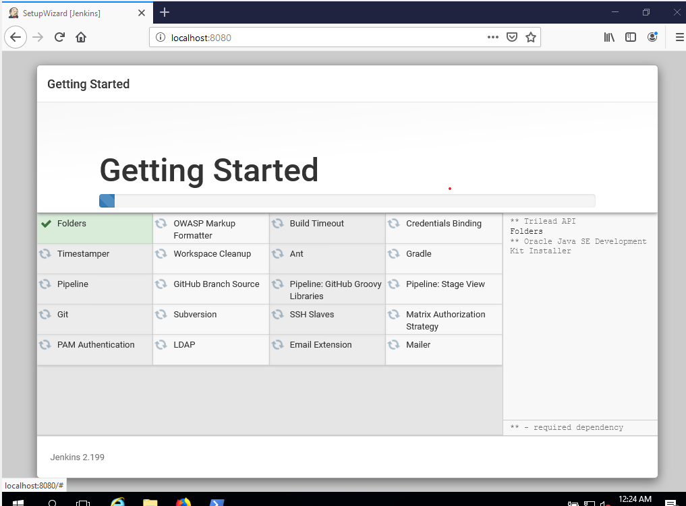
- Create your admin user
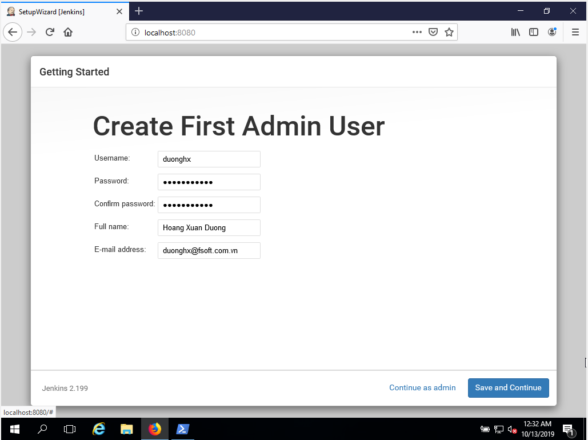
- Fill your ip address to *JenkinsURL* field as below >> *Save and Continue*
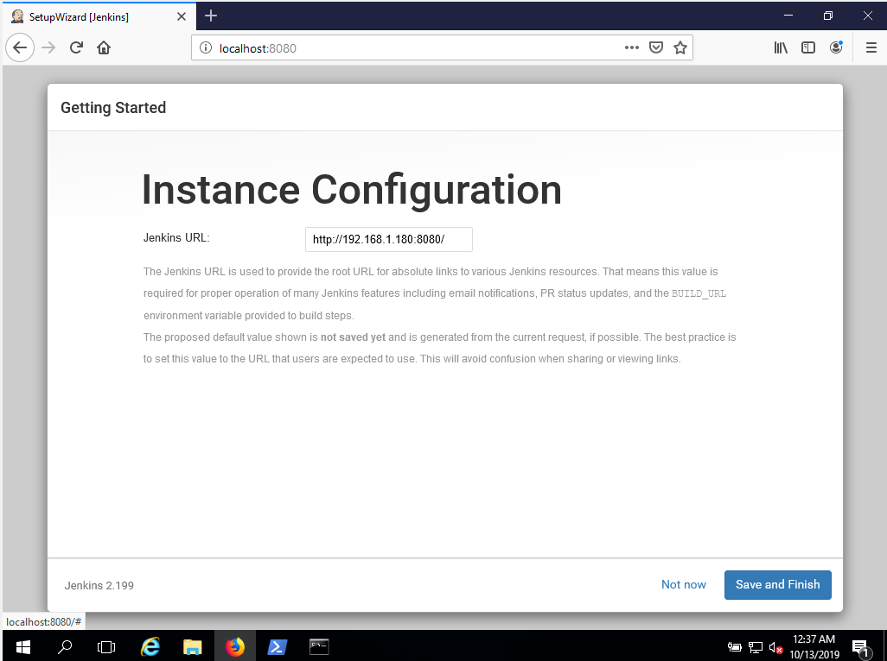
- You will see Jenkins Dashboard.
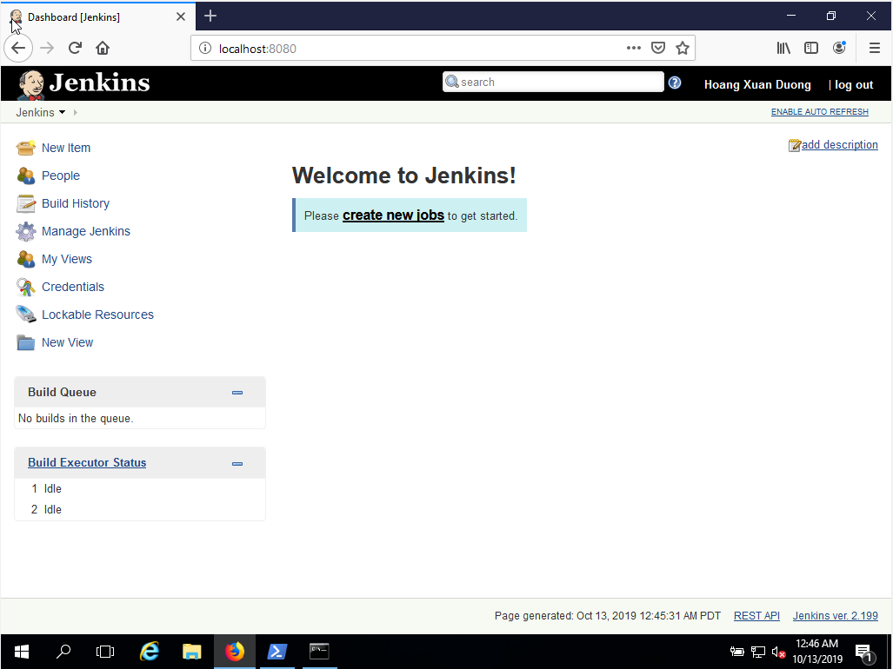
- Now, you can access to this Jenkins from another computer
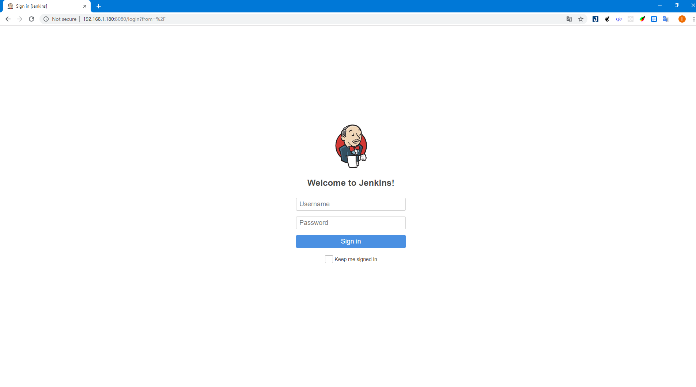

### Install plugin

- As I mention at comment I suggest to use two plugins:
  - *Gitlab plugin*: Use for trigger Jenkins when have changes on Gitlab.
  - *Conffig File Provider Plugin*: Adds the ability to provide configuration files (i.e., settings.xml for maven, XML, groovy, custom files, etc.) loaded through the Jenkins UI which will be copied to the job's workspace and you can setting your settings.xml on Jenkins GUI.

- To install plugin from Jenkins Dashboard above choose *Manage Jenkins >> Manage Plugins >> Available*
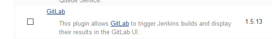
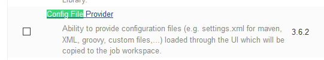
- Check to box beside plugin name and click install without install
- Then back to dashboard

### Create an agent (node in Jenkins)

- Firstly, go to *Manage Jenkins >> Configure Global Security >> TCP port for inbound agents >> Random* to allow agent connect to a random port.
- Login to Jenkins from agent, then go to *Manage Jenkins >> Manage Nodes >> New Nodes* to create new node
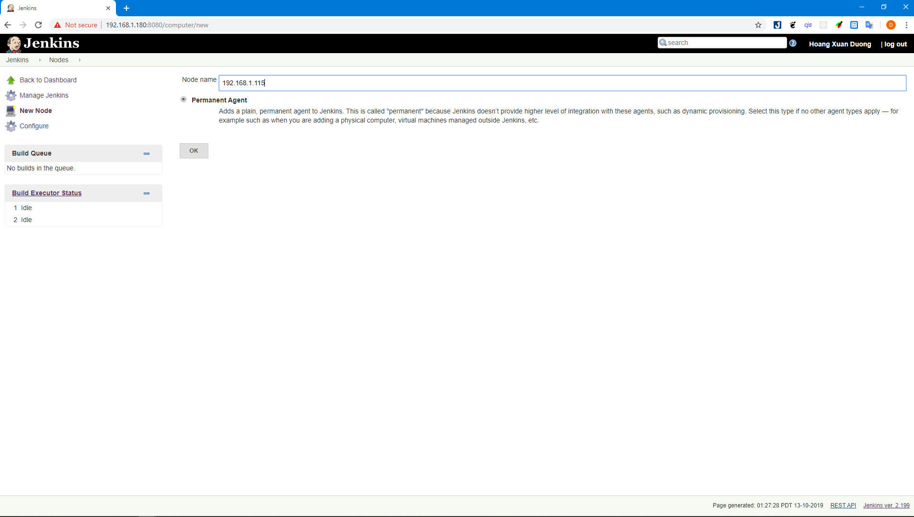
- Fill node name and check to *Permanent Agent*, I usually put my ip address to distinguish between different computers
- After click on OK button you will see:
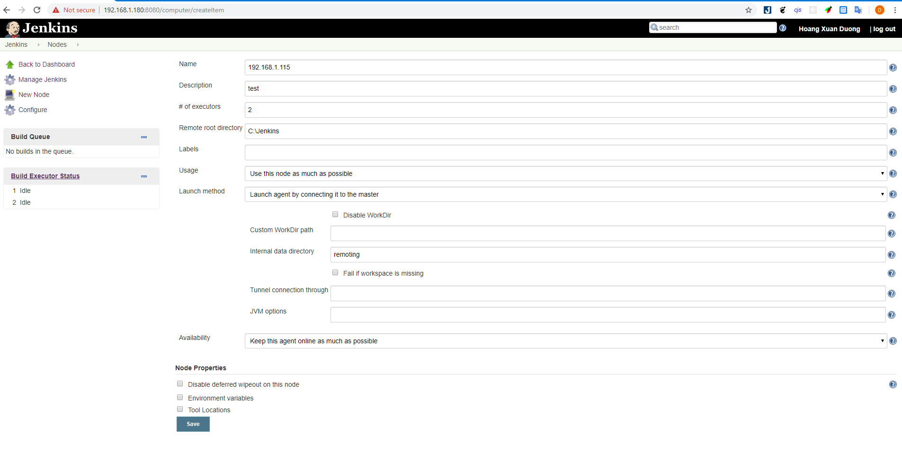
- In images above:
  - **Name**: Name that uniquely identifies of an agent
  - **Description**: This could include information useful to users, such as how many CPU cores the agent has, how much RAM it has installed, its physical location, etc.
  - **# of executors**: The maximum number of concurrent builds that Jenkins may perform on this node. A good value to start with would be the number of CPU cores on the machine.
  - **Remote root directory**: An agent needs to have a directory dedicated to Jenkins. Specify the path to this directory on the agent. It is best to use an absolute path, such as /var/jenkins or C:\jenkins
  - **Lable**: Labels (or tags) are used to group multiple agents into one logical group. (for more information you can click in "?" button to see description)
  - **Usage**: choose *Use this node as much as possible*. Whenever there is a build that can be done by using this node, Jenkins will use it.
  - **Launch method**: You should choose option *Launch agent by connecting it to the master* to allow an agent to be connected to the Jenkins master whenever it is ready.

- After config your node success click on Save button. Then you can see:
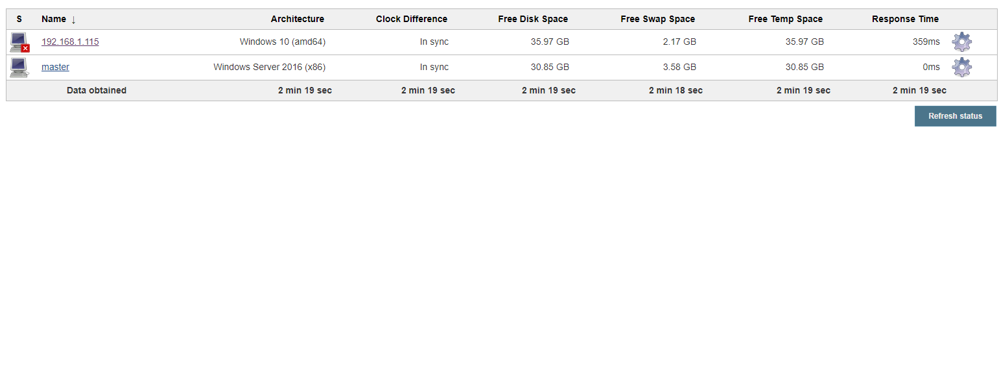
- Click on your node name and you can see ways to connect from agent to Jenkins.
- You can run from agent command line, just click on *agent.jar* link and run command `java -jar agent.jar -jnlpUrl http://192.168.1.180:8080/computer/192.168.1.115/slave-agent.jnlp -secret 11d95e8cad511db0d7a3d0cf18209f38babc8929a30a04e18570e925548cac21 -workDir "C:\Jenkins"` on folder that you dowwloaded agent.jar
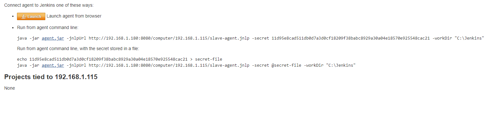
- You can also choose *Launch agent from browser*, click in Launch button a file name slave-agent.jnlp will download to your computer and auto connect to Jenkins.
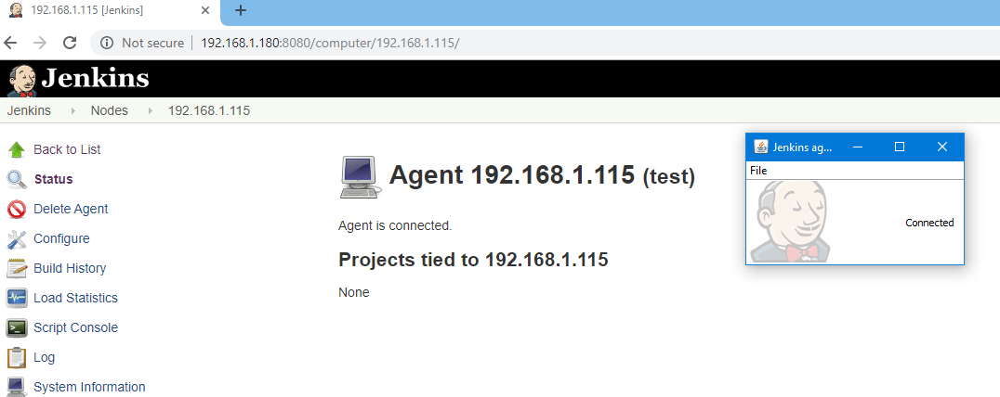
- The connection between agent and jenkins master is established
- I will guide how config gitlab plugin and use Conffig File Provider Plugin in create Jenkins script task
